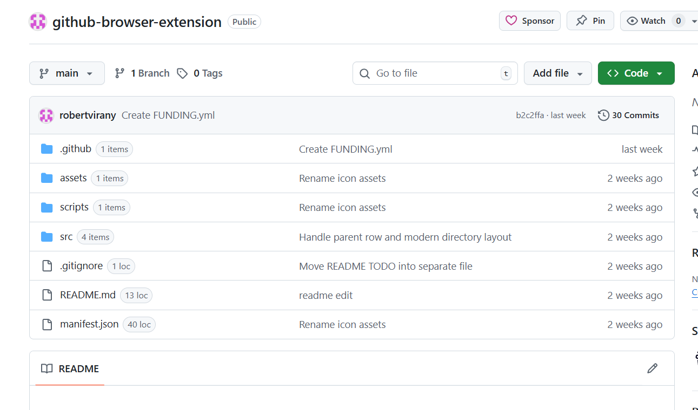

GitHub Helper: LOC & Dir Counts (Edge Extension)

What it does
- Adds a small badge next to each entry in GitHub repository file lists.
- For files: shows lines of code (LOC), counted from the raw file.
- For directories: shows the number of immediate entries (files + subdirectories).

Install in Microsoft Edge
1. Build is not required — it’s a plain MV3 extension.
2. Open `edge://extensions`.
3. Enable “Developer mode”.
4. Click “Load unpacked” and select this folder.
5. Navigate to any GitHub repo page and the badges will appear.
